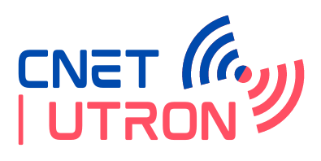

<h1>🔮 Cellular Network User Throughput-Downlink Prediction (CNET-UTRON) Dashboard </h1>

[](https://share.streamlit.io/hanifnew/cnet-utron-dashboard/main/dashboard.py)


<p align="center">
    
</p>

<h2>
    🔎 What is this app?
</h2>
<p>
    This app allows you to train, evaluate and optimize a Machine Learning model for User Throughput Downlink Prediction in just a few clicks. All you have to do is to upload a 4G LTE network  dataset from the G-Net Track Application or just choose the existing dataset in this app, and follow the guidelines in the sidebar to:
</p>
<p>
     🧪  Prepare data : Filter, aggregate, preprocess, and/or clean your dataset step by step.
</p>
<p>
     🛠️  Choose model parameters : Default parameters are available but you can tune them. Look at the tooltips to understand how each parameter is impacting forecasts.
</p>
<p>
     📝  Select evaluation method : Gain the metrics evaluation score and Define the evaluation process to assess your model performance.
</p>
<p>
     🔮  Generate forecast : Make a forecast on future throughput value with the model previously trained.
</p>

<h2>
    ⚙️ Application Architecture
</h2>
<p align="center">
    
</p>

<h2>
    📽️ Application Screencast
</h2>

<p align="center">
 
</p>

<h2>
    💡 How to use
</h2>

## 1. Create a virtual environtment (optional)
We strongly advise to create and activate a new virtual environment, to avoid any dependency issue.
For example with conda:
```bash
pip install conda
conda create -n cnet-utron python=3.8 
conda activate cnet-utron
```
Or with virtualenv
```bash
pip install virtualenv
python3.8 -m virtualenv cnet-utron --python=python3.8
source cnet-utron/bin/activate
```
## 2. Install package
```bash
pip install -r requirements.txt
```
to install dependencies.

## 3. Run app locally
```bash
streamlit run dashboard.py
```
to run the application.

## 4. Enjoy!


